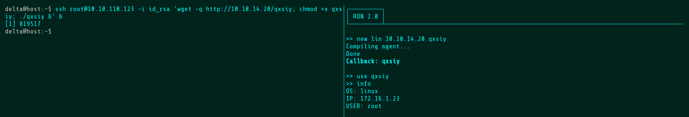
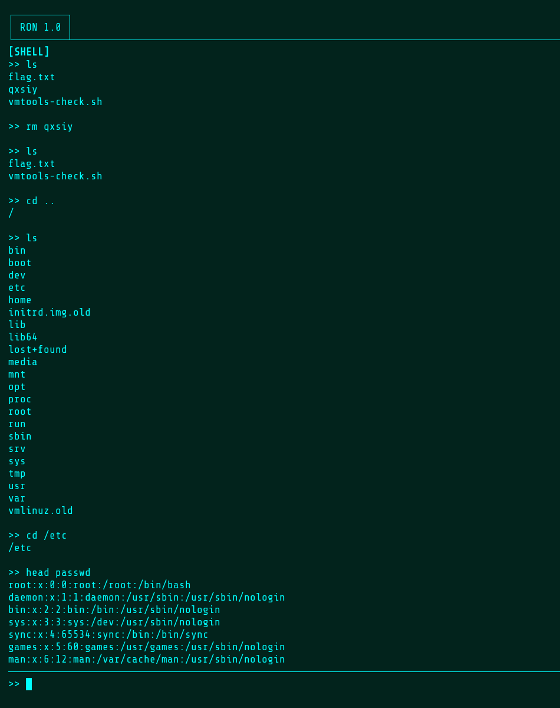
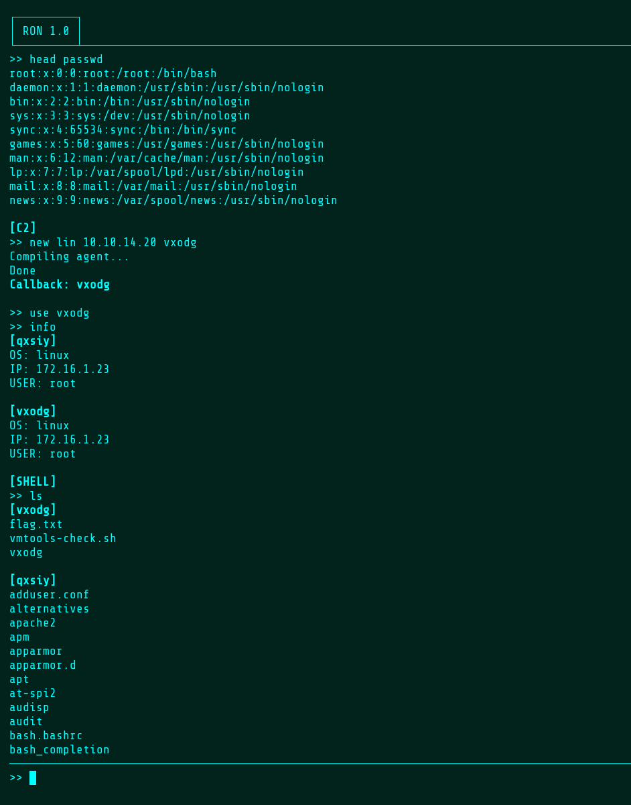
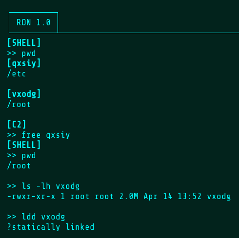

# RON  
RATs of Nim  
  
A lightweight C2 framework written in Nim (agent) and Python (server).  
  
<b>Highlights:</b>  
• Urwid terminal-based UI. Pretty!  
• WSS comms for stealth, speed, and security.  
• Agents are compatible with Linux and Windows*.  
• Command history (use arrow keys!)
• Scrollable output (use pgup/pgdn!)
• Shell mode with per-agent memory of the current working directory.
• Asynchronous and multithreaded for responsive, full-duplex interaction. Feels good!  
• Commands can be sent to multiple agents at once. Returned output is tagged with the ID of the agent it came from.  
• Static, stripped binaries for portability and minimal file size.  
  
*Currently untested on Windows. To do.  
  
<b>Coming Soon:</b>  
• Two-way resumable file transfer.  
• Encryption with mutual authentication via libsodium.  
• Automatic obfuscation.  
• In-memory C execution via LuaJIT FFI? Maybe...  
  
<b>Installation:</b>  
1. `git clone https://github.com/delta-plus/ron`  
2. `cd ron; resources/install`  
4. Start the server: `./ron`
5. Generate new agents: `new lin [server IP]`. Binaries will be found at resources/agents/[agent ID].  
&nbsp;&nbsp;&nbsp;The output directory can be set by editing resources/builder/build.
  
<b>Usage:</b>  
new [platform] [IP] ([port]) ([ID]) - Generate a new agent binary. Ports and IDs are random if unspecified. Platform should be "lin" or "win".  
use [agent ID] - Activate agent. This agent will now accept commands.  
free [agent ID] - Deactivate agent. The agent remains alive, but commands are not sent to it.  
info - Return info about the target host.  
shell - Enter shell mode.  
exit - Exit shell mode or the server interface. The server can also be shut down with the escape key.  
kill - Kill active agent(s).  
clear - Clears the output window. It even works in shell mode.  
  
<b>Examples:</b>  
Use `new [host IP]` to generate a new agent. Since the id is left unspecified, a random five-letter ID will be chosen and shown in the output window.  
An Alpine docker container is used to generate the agent binaries. In this example, an Ubuntu HackTheBox machine is used as the target.  
Run `use [ID]` to interact with the agent once a callback is received. Run `info` to show basic host info from the target.  

  
RON is divided into two windows: one for entering commands, one for displaying results.  
Type `clear` to clear the output and run `shell` to enter shell mode.  
Note that RON can delete itself and while still running in memory.  
Note also that changing directories by absolute or relative path is supported.  

  
Observe that a user may generate a second agent and interact with both at the same time.  
When using multiple agents, returned output is labeled with the matching agent ID.  
Note that qxsiy's current working directory is preserved when returning to shell mode.  

  
When an agent is freed, it doesn't receive commands. This also applies to the `kill` command.  
The agent binaries should come out at around 2 MB and will run on almost any Linux system.  

  
  
If upgrading and releasing a fork of this project, you are highly encouraged to name it IRON - Improved RATs of Nim.
